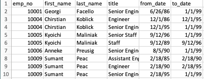
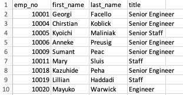
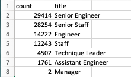
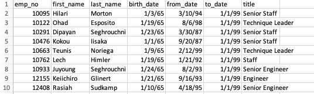
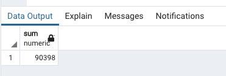
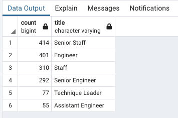
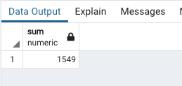

# Pewlett Hackard Analysis
[Link to Pewlett Hackard Queries](https://github.com/c-geisel/Pewlett-Hackard-Analysis/blob/main/Queries/Employee_Database_challenge.sql)

## Overview of the analysis
Pewlett Hackard is an old company that is having a wave of employees who will reach their retirement qualifications soon. The company is beginning to consider how many and which positions need to be filled. There are two desired outcomes in this analysis, the first deliverable is to determine the number of employees that will be retiring based on their most recent job title. The second deliverable is to create a table that will include the employees who are eligible to participate in a mentorship program. 

## Results 
Four tables were created to find the desired outcomes. Three tables were made to find the answer to the first outcome, and one was created for the second outcome. The first deliverable is to find the number of employees retiring grouped by job title.
1.  To begin deliverable one, a table is created with general employee information as well as job titles. This is done by joining columns from the employees and titles table. This data is filtered so that only employees born within a certain range (those eligible to retire) can be seen. 

2. After creating the retirement_titles table it is seen that employees appear in multiple rows with different job titles at different dates. This occurs because employees may have changed jobs within the company throughout their career. To resolve this issue, a DISTINCT ON statement is used to retrieve the first occurrence of each person’s name. Each employee’s name and title is then pulled from the retirement table and put into a unique_titles table that lists each employees first title. 

3. The final task needed to complete deliverable one is to find the number of employees by most recent title that are about to retire. This is done by counting the number of titles in the unique_titles table created above and placing the information into a new table called retiring_titles.

4. The outcome of deliverable two is to create a table of employees who would be eligible to mentor new employees for the company. To begin, employee information is retrieved from the employees, titles, and dept. employees tables. The data was then filtered to ensure all the employees listed were born within a certain year to ensure retirement eligibility and filtered to ensure they still were working with the company. 

## Summary 
### How many roles need to be filled?

To find how many roles will need to be filled as the "silver tsunami" takes place, another query needs to be performed. This can be found using the retiring_titles table. This table finds the number of employees retiring by title. We can find the total number by finding the sum of the counts using the following query.

'''

    SELECT SUM(Count)
    FROM retiring_titles;
    
'''

Upon running this query, we get the following output: 

This shows that there are a total of 90,398 positions that will need to be filled. To make an impact, a considerable amount of these roles will need to be filled, nearly all 90,000.

### Are there enough retirement-ready mentors?
Given that there are over 90,000 employees ready to retire, it is important that there are enough retirement-ready employees that could possibly mentor the next generation of employees. However, there would need to be quite a few mentors to accomplish this task. To find out the total number of mentors are available, we can count the mentorship_eligibility table much as we did to the unique_titles table. To begin, we can use the following query to count the elligible mentors by title based off the data from the mentorship_eligibility table:

'''

    SELECT COUNT(me.title), me.title
    INTO mentorship_eligibility_count
    FROM mentorship_eligibility as me
    GROUP BY me.title
    ORDER BY COUNT (me.title) DESC;
    SELECT*FROM mentorship_eligibility_count;

'''

Upon running this query, a table is created:

In this table we can see the number of mentors available by each title. However, it would be beneficial for us to know the total number of available mentors, so we can perform a SELECT SUM query on the count column in our new table to get the total number of members.

'''

    SELECT SUM(Count)
    FROM mentorship_eligibility_count;
    
'''

Upon running this query, we get the output:

In this output we can see that there are a total of 1,549 employees who are retiring that are eligible to mentor new employees. This means that there are not enough retirement-ready mentors. 1,500 employees would not be able to train all 90,000 employees that are soon to come. The company will need to find another avenue for training their new wave of employees. A possibility could be that retirement-ready employees could train a group of new staff members as opposed to just one person. But, it may be beneficial to use staff members who have been at the company for a long period of time, but are not yet ready to retire, as supplemental mentors to assist in training new employees.

